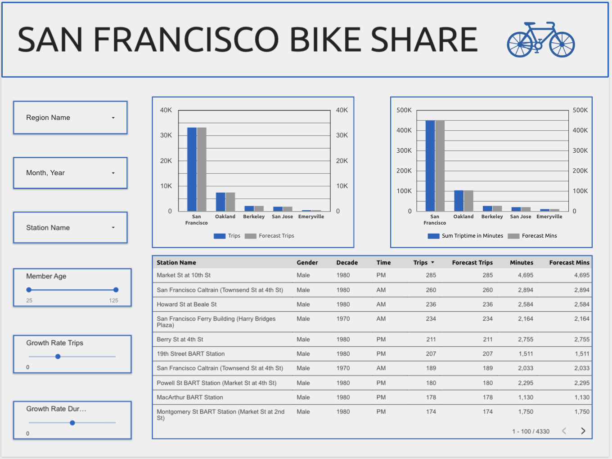

# San-Fransisco-Bike-Share-Dashboard

- This interactive dashboard analyzes bike trip date in the San Fransisco, Bay Area, offering information on rider behavior, usage trends based on Region, and forecasted growth based on user-controlled parameters.

## 🔧 Tools Used
- **Looker Studio** for data visualization
- **Google Sheets** for data hosting
- **Calculated fields, blended data sources, and dynamic filters** to simulate forecasting logic, and tying logic together 

## 📊 Key Features
- Region, station, age and date based filtering
- Customer growth rate parameters to model trip and duration growth
- Visual breakdowns of total trips, forecasted trips, trip time duration, and forecast duration

## 📸 Screenshot

## 💻 Link to interactive dashboard 
[View Dashboard](https://lookerstudio.google.com/reporting/a0a4291a-ea70-4c31-90e2-e1a29d5d03eb)

## 😎 What I learned 
- Blending multiple data sources through primary keys and foreign keys
- Using parameters and calculated fields to create custom controls for interaction
- Creating calculated field to simulate logic

## 💡 Reflection 
This was one of my first advanced dashboard looker projects, this was a big step forward in building clean user friendly dashboard. The usage of blends and parameters was the biggest difference in this dashboard compared to the others. Give me the ugly data and I'll make it something anyone can understand! 😎
